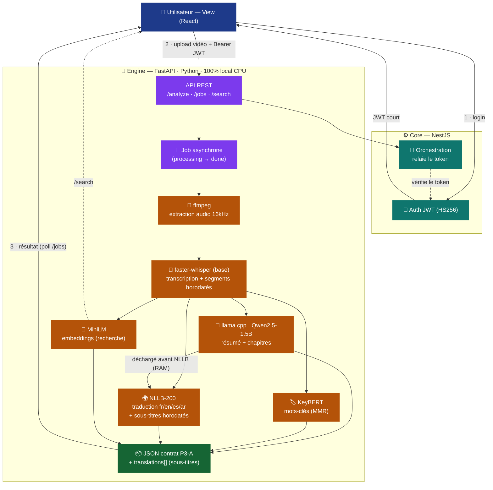

# Architecture du pipeline — Engine Pôle 3 (IA & Data)

Schéma du flux : de la vidéo au **JSON multilingue** (contrat P3-A + sous-titres).

## Légende
| Couleur | Brique |
|---|---|
| 🔵 Bleu | View (React) — interface, lecteur, sous-titres |
| 🟢 Teal | Core (NestJS) — auth + orchestration |
| 🟣 Violet | Engine (FastAPI) — API + jobs |
| 🟠 Orange | Modèles locaux (Whisper, llama.cpp, NLLB, MiniLM, KeyBERT) |
| 🟩 Vert | Sortie JSON (contrat + traductions) |

## Points clés
- **100 % local, CPU**, sans clé API payante.
- Traitement **asynchrone** (l'analyse prend du temps) : `POST /analyze` → poll `/jobs/{id}`.
- Traduction par **modèle dédié NLLB-200** (200 langues) ; le **LLM est déchargé** avant NLLB pour tenir dans la RAM.
- Sortie = **contrat P3-A** + `translations[]` (sous-titres horodatés multilingues).
